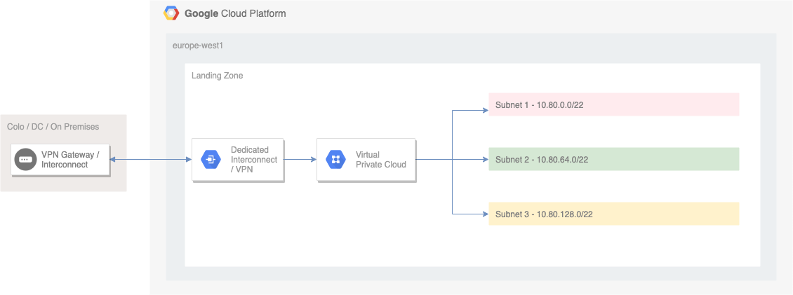
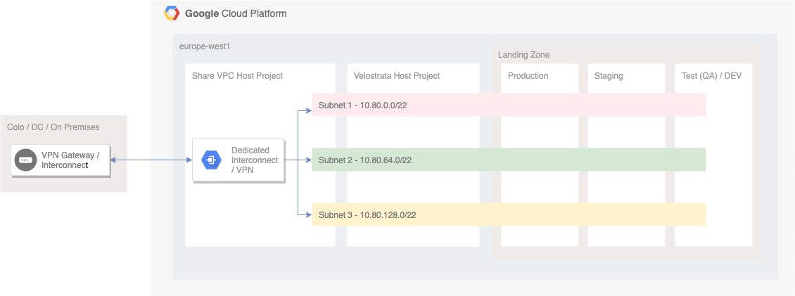
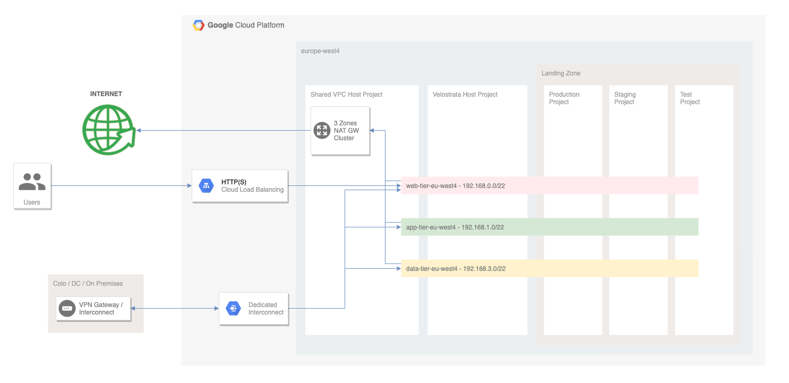

<!-----
 Copyright 2018 Google LLC

 Licensed under the Apache License, Version 2.0 (the "License");
 you may not use this file except in compliance with the License.
 You may obtain a copy of the License at

      http://www.apache.org/licenses/LICENSE-2.0

 Unless required by applicable law or agreed to in writing, software
 distributed under the License is distributed on an "AS IS" BASIS,
 WITHOUT WARRANTIES OR CONDITIONS OF ANY KIND, either express or implied.
 See the License for the specific language governing permissions and
 limitations under the License.
----->


# CFT Migrate for Compute Engine (Migrate for Compute Engine)

Using Cloud Foundation Toolkit (CFT) you can quickly deploy a landing zone for your [Migrate for Compute Engine](https://cloud.google.com/migrate/compute-engine/) migration to Google Cloud Platform (GCP) projects, save time and avoid misconfiguration issues.


## Migrate for Compute Engine Prerequisites


### Migration Qualification

Before proceeding with migration, you should already know:

1.  How many approximately VMs will be migrated
2.  What is migration target VMs source - Azure, AWS or on-prem
3.  How many GCP projects you will need for migrated VMs 
4.  Do you have/plan on-prem or other cloud connection to GCP via [VPN](https://cloud.google.com/vpn/docs/concepts/overview) / [Interconnect](https://cloud.google.com/hybrid-connectivity/)
5.  Is there any network load balancing involved
6.  How much storage will be needed in GCP


### Deployment Type

There are two types of deployment that you can choose from using CFT for Migrate for Compute Engine:

**Single-project** deployment where Migrate for Compute Engine frontend, Cloud Extension and migrated VMs hosted under the same GCP project:



**Multi-project** deployment, environment is split into four or more different GCP projects to host separated shared VPC, Migrate for Compute Engine frontend and migrated VMs:



**Example** of high level architecture for a multi project landing zone:



### Technical Prerequisites

CFT for Migrate for Compute Engine is build on top of [Google Cloud Project Factory Terraform Module](https://github.com/terraform-google-modules/terraform-google-project-factory) and if additional customization needed please refer to the [documentation](https://github.com/terraform-google-modules/terraform-google-project-factory/blob/master/README.md).

You will create the following via CFT and Terraform:

1.  GCP project to host Migrate for Compute Engine Manager and Cloud Extensions (CE)
1.  GCP VPC Project (if shared VPC will be used)
1.  VPC with subnets
1.  [Firewall rules](https://cloud.google.com/migrate/compute-engine/docs/4.5/concepts/planning-a-migration/network-access-requirements) for Migrate for Compute Engine
1.  GCP Network Tags for Migrate for Compute Engine
1.  Destination Projects
1.  GCP [roles and service accounts](https://cloud.google.com/migrate/compute-engine/docs/4.5/how-to/configuring-gcp/configuring-gcp-manually) for Migrate for Compute Engine
1.  VPN (Optional)


Finally [deploying](https://cloud.google.com/migrate/compute-engine/docs/4.5/how-to/configure-manager/configuring-on-gcp) Migrate for Compute Engine Manager via GCP [Marketplace](https://console.cloud.google.com/marketplace/details/click-to-deploy-images/velostrata?_ga=2.230596124.-1830265044.1554384916&_gac=1.75634663.1564563946.CL6bne_m3uMCFYYkGwodLkkPoQ).


## Getting Started


#### Configuring Migrate for Compute Engine Landing Zone with CFT


### Tools

**Install Cloud SDK** \
The Google Cloud SDK is used to interact with your GCP resources. [Installation instructions](https://cloud.google.com/sdk/downloads) for 

multiple platforms are available online.

**Install Terraform** \
Terraform is used to automate the manipulation of cloud infrastructure. Its [installation instructions](https://www.terraform.io/intro/getting-started/install.html) are also available online.

**Authenticate gcloud** \
Prior to running this, ensure you have authenticated your gcloud client by running the following command: 


```
gcloud auth application-default login
```


### Deployment

Download the repository:


```
git clone https://github.com/terraform-google-modules/terraform-google-migrate.git
```


File structure

The project has the following folders and files:


```

/: root folder
/examples: examples for using Project Factory Terraform Module
/modules: Scripts for specific tasks on module (see Infrastructure section on this file)
/helpers: Optional helper scripts for ease of use
/core: Resources to create a core project
/single: Resources for single project deployment
/multi: Resources for multi project deployment
/main.tf: main file for this module, contains all the resources to create
/variables.tf: all the variables for the module
/output.tf: the outputs of the module
/readme.md: this file

```


We will start with deploying our **core** project:


```
cd core
```


Provide this variables in terraform.tfvars:


```
organization_id = "GCP ORGANIZATION ID"
billing_account = "GCP BILLING ID"
default_service_account = "KEEP/DELETE/DEPRIVILEGE" 
project_id = "CORE PROJECT THAT WILL BE CREATED ID"
```


Initialize, plan and deploy:


```
terraform init
tf plan -var-file="terraform.tfvars"
tf apply -var-file="terraform.tfvars"
```


Once this successfully completed move to either **single** or **multi** project deployment section:

**Single project deployment:**


```
cd ..
cd single
```


Provide this variables in terraform.tfvars:


```
project_id = "GCP CORE PROJECT ID"
network_name = "NETWORK NAME TO APPLY FOR THE VPC"
subnet_01_ip = "GCP VPC SUBNET IP"
subnet_02_ip = "GCP VPC SUBNET IP"
subnet_03_ip = "GCP VPC SUBNET IP"
secondary_s01_range = "SECONDARY IP VPC SUBNET RANGE"
secondary_s02_range = "SECONDARY IP VPC SUBNET RANGE"
secondary_s03_range = "SECONDARY IP VPC SUBNET RANGE"
subnet_01_region = "GCP VPC REGION"
subnet_02_region = "GCP VPC REGION"
subnet_03_region = "GCP VPC REGION"
local_subnet_01_ip = "ON-PREM/OTHER CLOUD SUBNET"
```


Once complete continue with [deploying](https://cloud.google.com/migrate/compute-engine/docs/4.5/how-to/configure-manager/configuring-on-gcp) Migrate for Compute Engine Manager via GCP [Marketplace](https://console.cloud.google.com/marketplace/details/click-to-deploy-images/velostrata?_ga=2.230596124.-1830265044.1554384916&_gac=1.75634663.1564563946.CL6bne_m3uMCFYYkGwodLkkPoQ) and Migrate for Compute Engine [backend](https://cloud.google.com/migrate/compute-engine/docs/4.5/how-to/configure-manager/configuring-vms-vm) or [prerequisites](https://cloud.google.com/migrate/compute-engine/docs/4.5/how-to/migrate-aws-to-gcp/overview) for AWS if migrating from AWS, and [prerequisites](https://cloud.google.com/migrate/compute-engine/docs/4.5/how-to/migrate-azure-to-gcp/azure-prerequisites) for Microsoft.

**Multi project deployment:**


```
cd ..
cd multi
```


Provide this variables in terraform.tfvars:


```
organization_id = "GCP ORGANIZATION ID"
billing_account = "GCP BILLING ID"
default_service_account = "KEEP/DELETE/DEPRIVILEGE" 
vpc_project_id = "GCP CORE PROJECT ID"
prod_project_id = "GCP PROD PROJECT ID"
test_project_id = "GCP TEST PROJECT ID"
stage_project_id = "GCP STAGING PROJECT ID"
velo_project_id = "GCP VELOSTRATA PROJECT ID"
network_name = "NETWORK NAME TO APPLY FOR THE VPC"
subnet_01_ip = "GCP VPC SUBNET IP"
subnet_02_ip = "GCP VPC SUBNET IP"
subnet_03_ip = "GCP VPC SUBNET IP"
secondary_s01_range = "SECONDARY IP VPC SUBNET RANGE"
secondary_s02_range = "SECONDARY IP VPC SUBNET RANGE"
secondary_s03_range = "SECONDARY IP VPC SUBNET RANGE"
subnet_01_region = "GCP VPC REGION"
subnet_02_region = "GCP VPC REGION"
subnet_03_region = "GCP VPC REGION"
local_subnet_01_ip = "ON-PREM/OTHER CLOUD SUBNET"
```


Once complete continue with [deploying](https://cloud.google.com/migrate/compute-engine/docs/4.5/how-to/configure-manager/configuring-on-gcp) Migrate for Compute Engine Manager via GCP [Marketplace](https://console.cloud.google.com/marketplace/details/click-to-deploy-images/velostrata?_ga=2.230596124.-1830265044.1554384916&_gac=1.75634663.1564563946.CL6bne_m3uMCFYYkGwodLkkPoQ) and Migrate for Compute Engine [backend](https://cloud.google.com/migrate/compute-engine/docs/4.5/how-to/configure-manager/configuring-vms-vm) or [prerequisites](https://cloud.google.com/migrate/compute-engine/docs/4.5/how-to/migrate-aws-to-gcp/overview) for AWS if migrating from AWS, and [prerequisites](https://cloud.google.com/migrate/compute-engine/docs/4.5/how-to/migrate-azure-to-gcp/azure-prerequisites) for Microsoft Azure.
